# Gabe's new dotfiles | [Codeberg](https://codeberg.org/sykesgabri/dotfiles2) | [Github](https://github.com/sykesgabri/dotfiles2)

This repo contains my most recent set of dotfiles, specifically for i3. My previous dotfiles can be found [here](https://github.com/sykesgabri/dotfiles).

I use these dotfiles on Arch, and as such will be referencing pacman commands, the AUR, and how packages are named in Arch's repos specifically. If you're wanting to set my dotfiles up on something that isn't Arch based, keep this in mind.

## Stuff you'll need, and my preferred programs:

### Stuff you can get from pacman:
- Git
- Stow
- wget
- unzip
- i3 Window Manager
- i3lock
- arandr
- Rofi
- Polybar
- Nitrogen
- Alacritty
- zsh
- zsh-syntax-highlighting
- Starship
- Fastfetch
- Noto Fonts CJK
- lxsession
- nwg-look
- papirus-icon-theme
- Picom
- playerctl
- python-distutils-extra
- Neovim
- Flameshot
- Thunar
- Flatpak

Here's a massive pacman command to install all this stuff:
```
sudo pacman -S --needed git stow wget unzip i3-wm i3lock arandr rofi polybar nitrogen alacritty zsh zsh-syntax-highlighting starship fastfetch noto-fonts-cjk lxsession nwg-look papirus-icon-theme picom playerctl python-distutils-extra neovim flameshot thunar flatpak
```

### Stuff you can't get from pacman:

#### Yay:
```
cd ~
mkdir --parent .gitclones/AUR && cd .gitclones/AUR
git clone https://aur.archlinux.org/yay.git && cd yay
makepkg -si
```

#### zscroll:
```
yay -S zscroll-git
```

#### BetterControl:
```
yay -S better-control-git
```

#### polybar-spotify:
```
cd ~
mkdir .gitclones && cd .gitclones
git clone https://github.com/PrayagS/polybar-spotify
```
NOTE: May require some tweaking depending on your setup. For example, in my case, I have to modify the playerctl commands in the bash scripts to look for "chromium" because I use Tidal instead of Spotify.

#### HurmitMono Nerd Font:
```
mkdir --parent ~/Downloads/Hurmit
cd ~/Downloads/Hurmit
wget https://github.com/ryanoasis/nerd-fonts/releases/download/v3.3.0/Hermit.zip
unzip Hermit.zip
rm -rf Hermit.zip
cd ..
sudo mv Hermit/ /usr/share/fonts
```

#### Streamcontroller:
```
flatpak install flathub com.core447.StreamController
```

#### Catppuccin Mocha Mauve GTK Theme:
```
mkdir ~/.themes
cd ~/.themes
wget https://github.com/catppuccin/gtk/releases/download/v1.0.3/catppuccin-mocha-mauve-standard+default.zip
unzip catppuccin-mocha-mauve-standard+default.zip
rm -rf catppuccin-mocha-mauve-standard+default.zip
```
NOTE: Set theme with nwg-look.

#### Catppuccin Mocha Mauve Papirus Folders:
```
cd ~
mkdir --parent .gitclones/catppuccin && cd .gitclones/catppuccin
git clone https://github.com/catppuccin/papirus-folders.git
cd papirus-folders
sudo cp -r src/* /usr/share/icons/Papirus
curl -LO https://raw.githubusercontent.com/PapirusDevelopmentTeam/papirus-folders/master/papirus-folders && chmod +x ./papirus-folders
./papirus-folders -C cat-mocha-mauve --theme Papirus-Dark
```
NOTE: Set icon theme with nwg-look.

#### Catppuccin Mocha Mauve Cursors:
```
yay -S catppuccin-cursors-mocha
```
NOTE: Set cursor theme with nwg-look.

#### Floorp:
```
yay -S floorp-bin
```

## Installation:

1. Install the various things listed above.
2. Clone this repo into your home directory, and cd into it:
```
cd ~
git clone https://github.com/sykesgabri/dotfiles2
mv dotfiles2 .dotfiles
cd .dotfiles
```
3. Use Stow to create symlinks from the repo to your home directory:
```
stow .
```
NOTE: If you get a `Stowing . would cause conflicts` error, it is because there is a file in your home directory with the same name and location as a file in the dotfiles. Simply `rm -rf` the directories listed as conflicting, making sure you remove the ones in your home directory, not the dotfiles.

## Setting up Floorp the way I like it:

The reason my .mozilla folder is not included in the dots is a combination of just being careful, and it only working some of the time when transferring to new installs. In lieu of that folder, I'll just document how Floorp is set up on all my computers regardless of type or OS. My settings are fairly strict, and I make use of a good number of extensions, you may wish to do stuff differently, this is just how I do it.

NOTE: These screenshots are from Firefox, when I was still using that. I'm on Floorp now, but I'll keep these screenshots here because the settings are 99% the same, with only a handful of extra things added by Floorp.

<details>
<summary>Floorp settings:</summary><br>

### General

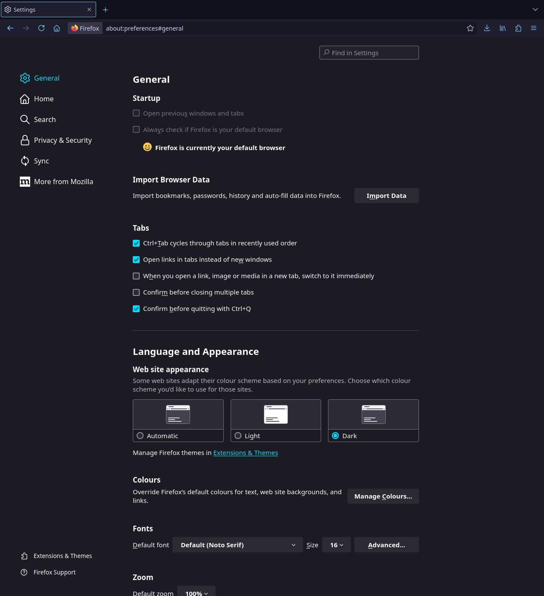<br>
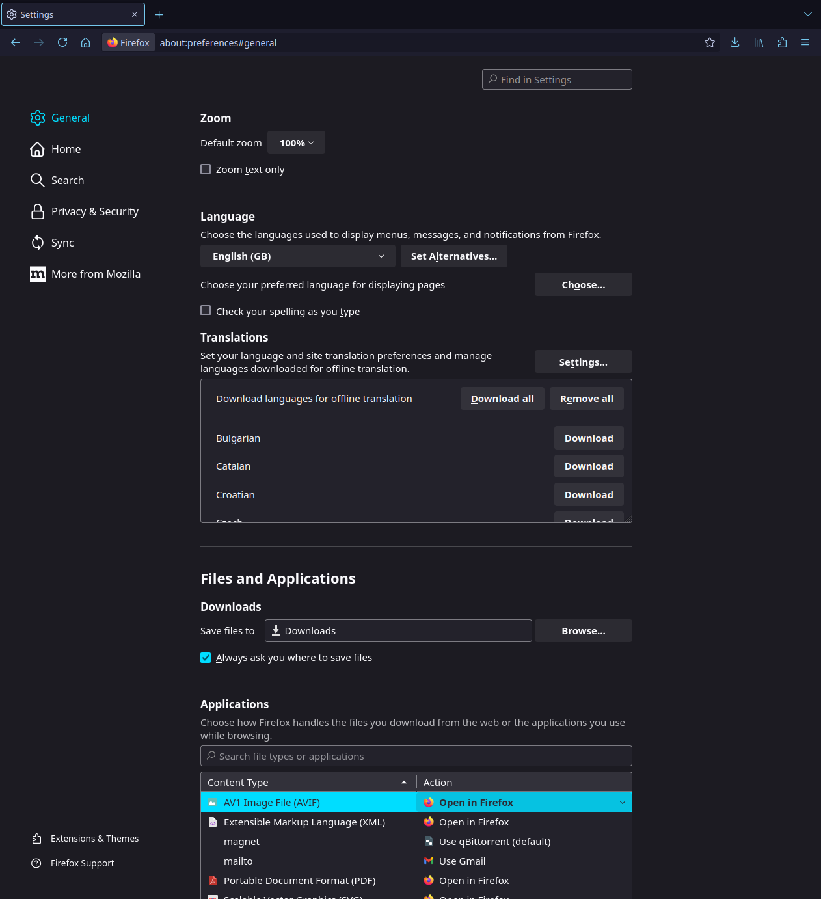<br>
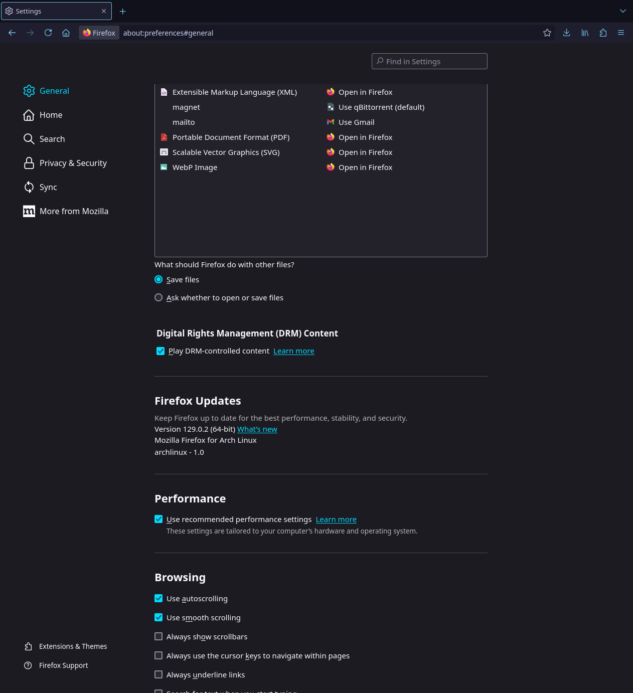<br>
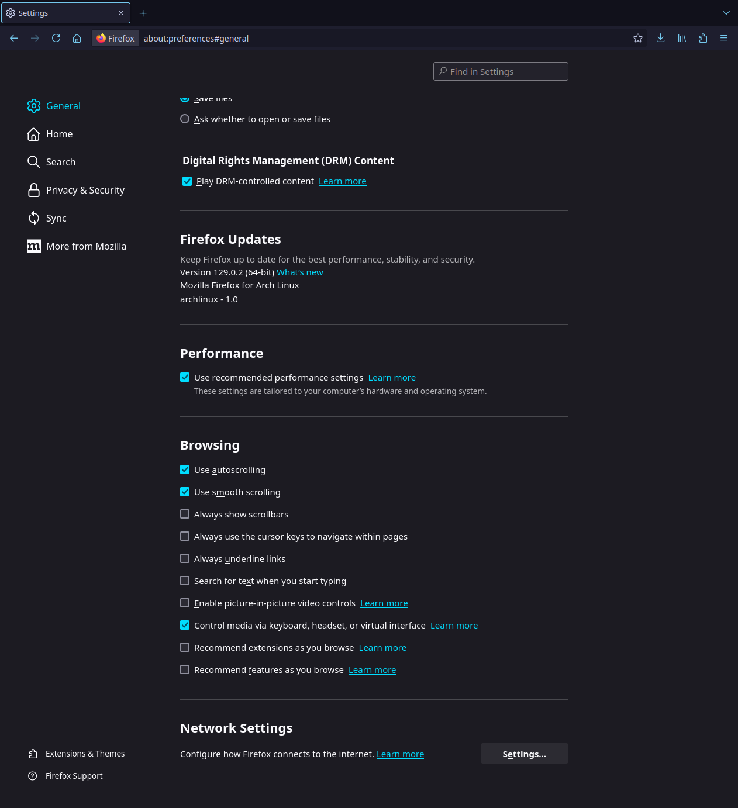

### Home

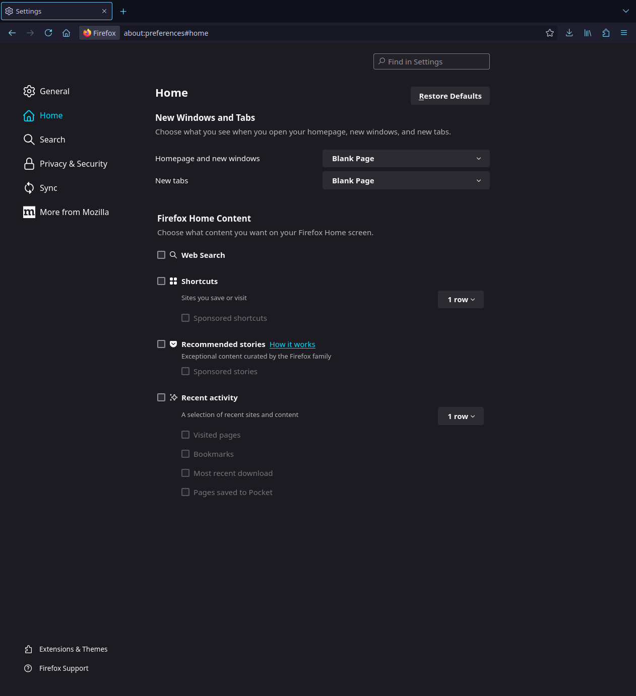

### Search

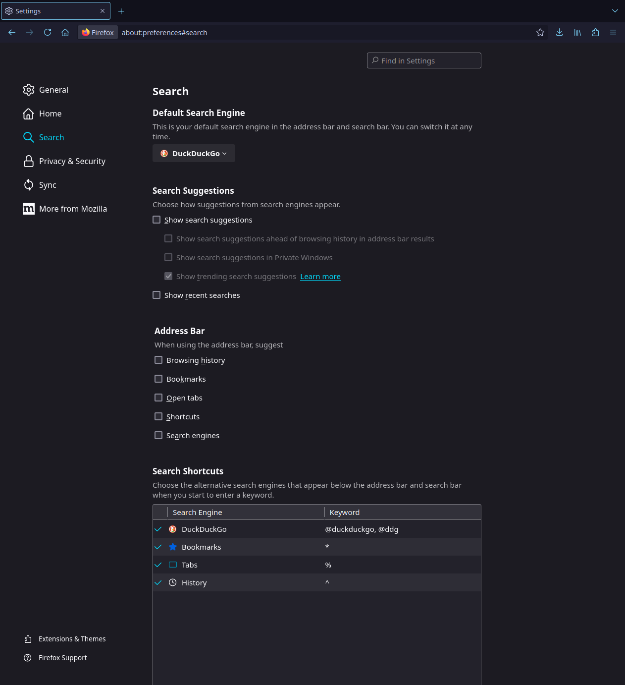

### Privacy & Security

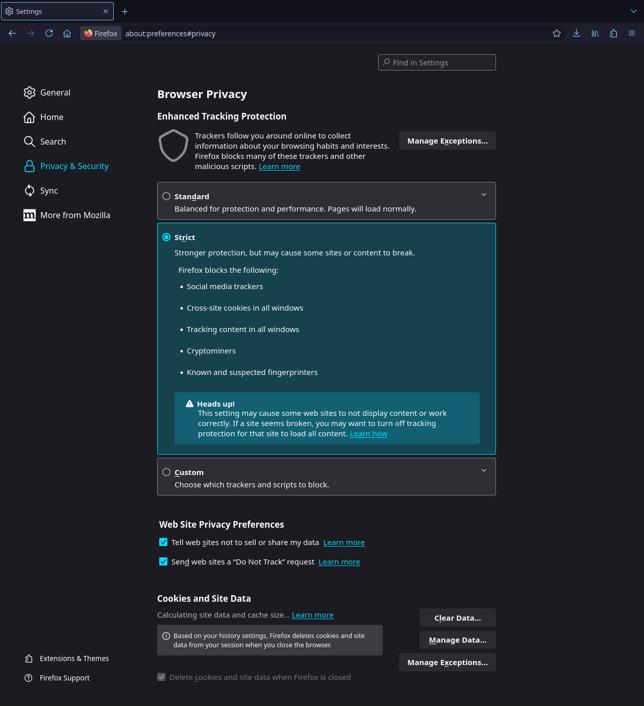<br>
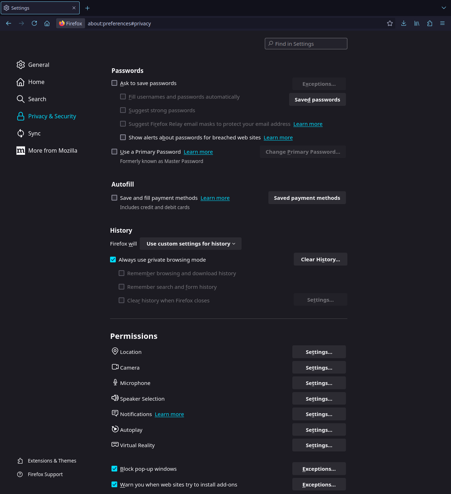<br>
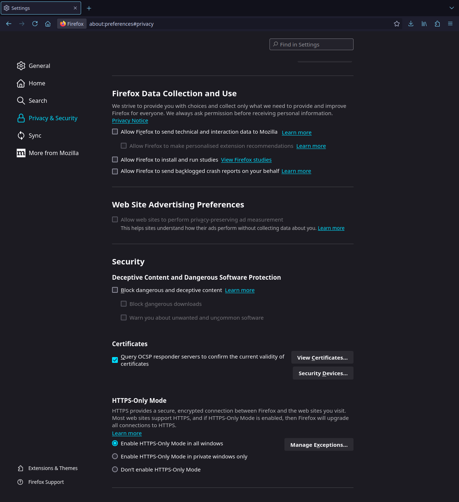<br>
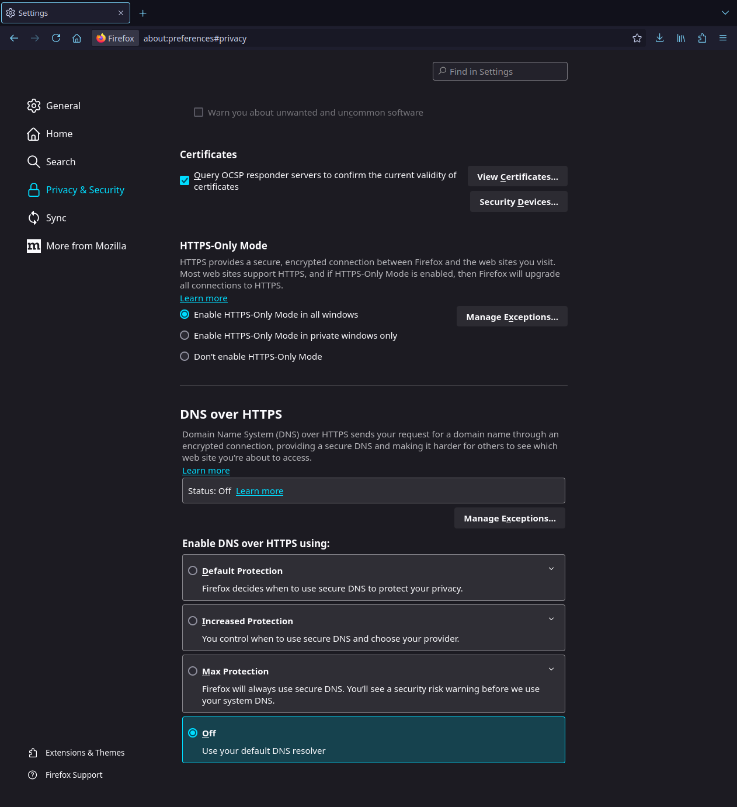

Set all permissions to auto disallow (you can still manually enable them on a per site basis when needed), and autoplay to block audio and video.

No syncing, no importing from previous browser, set Floorp to default browser.

</details>

<details>
<summary>Extensions:</summary><br>

- [uBlock Origin](https://addons.mozilla.org/en-GB/firefox/addon/ublock-origin/)
- [SponsorBlock](https://addons.mozilla.org/en-GB/firefox/addon/sponsorblock/) (All categories set to manual skip, highlights, chapters, and muted segments turned off)
- [Return YouTube Dislike](https://addons.mozilla.org/en-GB/firefox/addon/return-youtube-dislikes/) (Neon ratio bar and thumbs)
- [Unhook](https://addons.mozilla.org/en-GB/firefox/addon/youtube-recommended-videos/) <br> 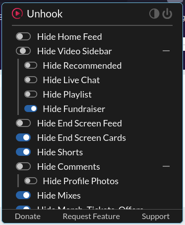<br>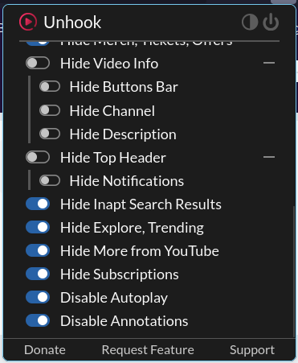<br>
- [Violentmonkey](https://addons.mozilla.org/en-GB/firefox/addon/violentmonkey/) (List of userscripts below)
- [Fastforward](https://addons.mozilla.org/en-GB/firefox/addon/fastforwardteam/)
- [User-Agent Switcher and Manager](https://addons.mozilla.org/en-GB/firefox/addon/user-agent-string-switcher/)
- [YouTube Volume Normalizer](https://addons.mozilla.org/en-GB/firefox/addon/youtube-volume-normalizer/)
- [Stylus](https://addons.mozilla.org/en-GB/firefox/addon/styl-us/) (json backup of my various installed styles in `scripts` directory)
- [Wayback Machine](https://addons.mozilla.org/en-GB/firefox/addon/wayback-machine_new)
- [Turn Off the Lights](https://addons.mozilla.org/en-GB/firefox/addon/turn-off-the-lights/)
- [Firefox Color](https://addons.mozilla.org/en-GB/firefox/addon/firefox-color) (Used to apply [Catppuccin](https://github.com/catppuccin/firefox) to Floorp)
- [TOSDR](https://addons.mozilla.org/en-GB/firefox/addon/terms-of-service-didnt-read/)
- [TTV LOL PRO](https://addons.mozilla.org/en-GB/firefox/addon/ttv-lol-pro/)
- [No Dumb TLDs](https://addons.mozilla.org/en-GB/firefox/addon/no-dumb-tld-s/)

Userscripts:
- [YouTube Shorts Redirect](https://greasyfork.org/en/scripts/439993-youtube-shorts-redirect)
- [Twitch Auto Channel Points Claimer](https://greasyfork.org/en/scripts/392348-twitch-auto-channel-points-claimer)
- [Restore YouTube Username](https://greasyfork.org/en/scripts/468740-restore-youtube-username-from-handle-to-custom)

Userstyles:
- The `scripts` directory of this repo contains a json file named `stylus-2025-03-04.json`. Download that, then open Stylus's dashboard, click "import", and select this json file. The various userthemes I use should automatically install and be set up.
All Catppuccin variants are Mocha Mauve.

</details>

## If you are not me, read this:

Some parts of these dotfiles will be very specific to my setup, which is probably not the exact same as yours. Assuming you are not me, here's a list of some configs you may want to change:

- The .sh files in .screenlayout/ correspond to my monitor setup. I strongly recommend deleting them and using arandr to create a .sh file for your monitor setup. Ensure that whatever you name it is reflected in the exec command at the bottom of .config/i3/config so that it is automatically executed when you log in.

- You may wish to remove various exec commands from the i3 config. The top one prevents the screen from going to sleep. The rest correspond to various programs, some of which you may not use. Just don't delete the ones for lxsession, picom, the .screenlayout/ script, polybar, and nitrogen.

This repo was created following this tutorial: https://www.youtube.com/watch?v=y6XCebnB9gs
